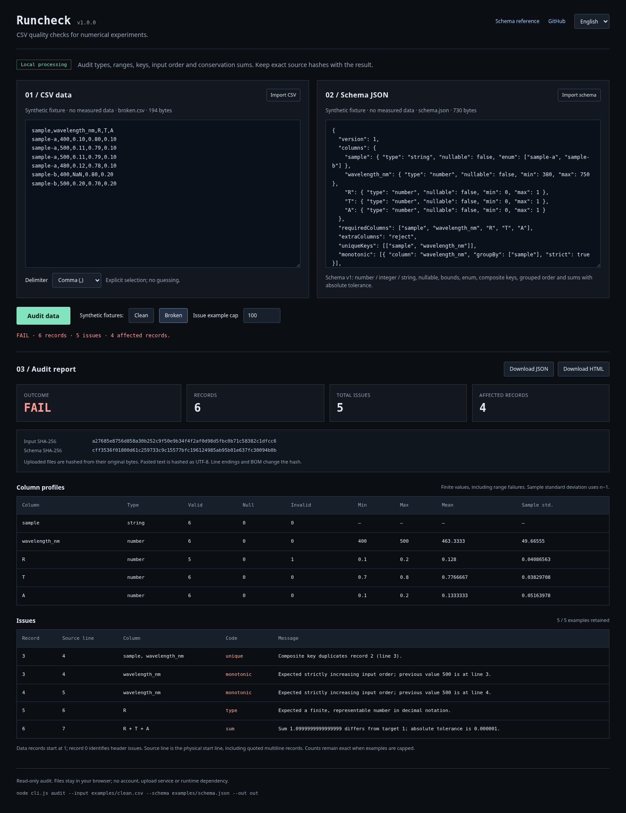

# Runcheck

在 CSV 变成图表、拟合结果或公开数据之前，先检查一次。

Runcheck 是一个面向数值实验的小型本地数据检查工具。用 JSON 描述列规则，检查类型、范围、组合键、原始行顺序和逐行求和，输出可直接打开的 HTML 报告和带原始文件哈希的 JSON 报告。

[](https://bdbddscat.github.io/portfolio-studio-demos/runcheck/)

[浏览器演示](https://bdbddscat.github.io/portfolio-studio-demos/runcheck/) · [English](README.md) · [完整规则文档](docs/schema.md) · [MIT 许可证](LICENSE)

**Node.js 22+ · 无运行时依赖 · 浏览器与 CLI · MIT**

## 先运行一个例子

在本目录执行：

```sh
node cli.js audit --input examples/clean.csv --schema examples/schema.json --out reports/clean
```

```text
PASS · 6 records · 5 columns · 0 issues · 0 invalid records
```

打开 `reports/clean/report.html` 查看报告，或在程序中读取 `report.json`。再试试有问题的文件：

```sh
node cli.js audit --input examples/broken.csv --schema examples/schema.json --out reports/broken
```

这份合成光学数据包含重复的样品/波长组合、倒退的波长、`NaN`，以及 `R + T + A = 1.1` 的一行。命令返回退出码 **1**，仍会写出两份报告。示例用于说明规则，并非测量结果或光学仿真输出。

在本地使用浏览器工作台：

```sh
python3 -m http.server 8099 --bind 127.0.0.1
```

打开 <http://127.0.0.1:8099>。CSV 和规则文件在浏览器内检查，无需账户、API 密钥或远程处理服务。

## 命令行

```text
runcheck audit --input FILE --schema FILE --out DIRECTORY
               [--delimiter comma|tab|semicolon]
               [--max-issues N] [--force]
```

可以始终用 `node cli.js` 代替 `runcheck`。需要在本地启用 `runcheck` 命令时执行 `npm link`。CLI、库和测试都不需要先运行 `npm install`。

| 参数 | 含义 |
| --- | --- |
| `--input FILE` | UTF-8 CSV 文件，首条记录为表头。 |
| `--schema FILE` | UTF-8 JSON 规则文件，版本为 1。 |
| `--out DIRECTORY` | 创建目录并保存 `report.json` 与 `report.html`。 |
| `--delimiter` | 默认 `comma`，也支持 `tab` 和 `semicolon`。 |
| `--max-issues N` | 保存 0–10000 条问题示例，默认 100。问题总数和统计始终覆盖完整输入。 |
| `--force` | 替换已有报告。未指定时，两种报告文件名只要有一个已存在，命令就会停止。 |
| `--help` / `--version` | 查看帮助或软件版本。 |

退出码 **0** 表示全部配置的规则通过；**1** 表示存在数据问题；**2** 表示参数、读取、写入、CSV 格式或规则错误。未知或重复参数、缺失参数值、非法分隔符都会返回 2。解析和规则错误不会生成检查报告。检查不会修改输入文件。

```sh
node cli.js audit --input scan.tsv --schema scan.schema.json --out reports/scan --delimiter tab --max-issues 25
```

## 定义规则

```json
{
  "version": 1,
  "columns": {
    "sample": { "type": "string", "enum": ["sample-a", "sample-b"] },
    "wavelength_nm": { "type": "number", "min": 380, "max": 750 },
    "R": { "type": "number", "min": 0, "max": 1 },
    "T": { "type": "number", "min": 0, "max": 1 },
    "A": { "type": "number", "min": 0, "max": 1 }
  },
  "extraColumns": "reject",
  "uniqueKeys": [["sample", "wavelength_nm"]],
  "monotonic": [{ "column": "wavelength_nm", "groupBy": ["sample"], "strict": true }],
  "sums": [{ "columns": ["R", "T", "A"], "target": 1, "tolerance": 0.000001 }]
}
```

规则字段和默认行为：

- `version` 必须为 `1`。`columns` 是非空对象，列名须非空且不能有首尾空白。表头区分大小写，按原文匹配。未知规则字段会报错，避免拼写错误被忽略。
- 默认要求所有已声明列存在。显式设置 `requiredColumns` 后，仅其中的列为必需列；`requiredColumns: []` 允许所有声明列缺省。可选列一旦出现，仍执行对应规则。
- `type` 支持 `string`、`number`、`integer`。数字接受有限十进制和指数表示，例如 `-0.5`、`.25`、`1e-6`。`NaN`、`Infinity`、十六进制、千位分隔符，以及下溢后变成零的非零值不通过。整数要求原始十进制表示确实为整数，并处于 JavaScript 安全整数范围内。
- `nullable` 默认 `false`。空字段和 `""` 都视为 null。数值转换时去除首尾空白，字符串保留原文空白。仅含空白的数值字段属于类型错误。
- `min`、`max` 是含边界的数值范围，不能用于字符串。`enum` 是非空数组，值类型须与列类型一致；数字完成转换后再比较枚举值。
- `extraColumns` 默认 `reject`，多出的表头产生问题；设为 `allow` 时允许额外列，但不会为其执行列规则或生成统计。
- `uniqueKeys` 中每个数组定义一组组合键。键按解析后的值比较，数值 `1` 与 `1.0` 等价。缺失、空值或类型错误的组合键跳过检查。字符串中的分隔符不会混淆元组边界。
- `monotonic` 按输入原始顺序检查每组数值。`groupBy` 定义分组键，省略时检查整个文件；`strict: true` 要求严格递增，默认 `false` 允许相等。空值或类型错误不重置上一条有效数值。检查不会给数据排序。
- `sums` 要求 `abs(sum - target) <= tolerance`。必须显式给出有限的 `target` 和非负有限的绝对 `tolerance`。成员缺失、为空或类型错误时跳过这一条跨列规则，单列问题仍计入总数。

数组中的列引用必须已在 `columns` 声明，并且不能重复。规则详解和完整英文参考见 [docs/schema.md](docs/schema.md)。

## CSV 解析与报告

支持逗号、Tab、分号，以及 UTF-8 BOM、LF、CRLF、CR 换行。带引号字段可以包含分隔符、换行和用 `""` 转义的双引号。闭合引号后只能接分隔符或换行。重复或空表头、未闭合引号、未引用字段中的双引号属于解析错误。字段数量与表头不一致则属于可报告的数据问题。

空白行也是数据记录；文件末尾的单个换行不会额外生成记录。表头名称不自动去除空白。Runcheck 不会自动猜测分隔符、补值或修复原始数据。

`counts.records` 不含表头；`counts.issues` 统计每个问题；`counts.invalidRecords` 对有问题的数据记录去重计数。同一记录可能有多个问题。表头问题使用 `record: 0`，数据记录从 **1** 开始。`startLine` 是该记录起始的实际文件行号，引用字段中的多行文本也会正确累计行号。

问题代码：`missing_column`、`extra_column`、`row_width`、`null`、`type`、`min`、`max`、`enum`、`unique`、`monotonic`、`sum`。每条问题还包含列名和说明；`issueCounts` 按代码汇总，保存的问题示例数量可由 `maxIssues` 限制。

`profiles` 为实际存在的声明列生成统计：已解析值数量、空值数量、类型错误数量，以及数值最小值、最大值、均值和**样本**标准差。通过类型转换但超出范围或不在枚举中的值仍纳入统计；空值和类型错误不纳入。少于两个数值时标准差为 null，字符串的数值统计均为 null。计算使用 JavaScript 浮点数；统计结果超出可表示范围时返回 null，并在 `statisticsWarning` 中说明溢出或下溢；缩放后的矩累积可避免微小变化的平方差下溢。

`hashes.inputSha256` 和 `hashes.schemaSha256` 对 CLI 读取的原始字节计算，包括 BOM、缩进和换行形式。报告还保存软件版本、分隔符、规范化规则和问题示例是否被截断。哈希用于辨认输入文件，不能证明数据来源。

## 在代码中调用

```js
import { readFile } from 'node:fs/promises';
import { makeReport, renderReportHTML } from './src/audit.js';

const input = await readFile('examples/clean.csv');
const schema = await readFile('examples/schema.json');
const report = await makeReport(input, schema, { maxIssues: 100 });
console.log(report.passed, report.hashes);
const html = renderReportHTML(report);
```

`makeReport` 的输入接受文本或 `Uint8Array`；规则接受对象、JSON 文本或 `Uint8Array`。规则对象按 `JSON.stringify(schema)` 的 UTF-8 字节计算哈希；要保留原始规则文件哈希，应传入原始字节。库中的分隔符参数使用实际字符 `','`、`'\t'`、`';'`。

还导出 `parseCSV`、`validateSchema`、同步的 `auditCSV`、`CSVParseError`、`SchemaError` 和 `SOFTWARE_VERSION`。`auditCSV` 返回不含哈希的检查报告，`makeReport` 在此基础上添加 SHA-256 信息。浏览器端哈希需要 HTTPS 或 localhost 的 Web Crypto。

## 接入 CI

在拉取仓库并设置 Node.js 后加入检查步骤：

```yaml
- name: Check numerical data
  working-directory: runcheck
  run: node cli.js audit --input examples/clean.csv --schema examples/schema.json --out reports/ci
- uses: actions/upload-artifact@v4
  if: always()
  with:
    name: runcheck-report
    path: runcheck/reports/ci/
```

数据问题通过退出码 1 让步骤失败，HTML 报告作为构建附件保存。生成的报告不纳入仓库版本控制。

## 开发

```sh
npm test
```

测试使用 Node.js 内置测试运行器。反馈问题时，请附上最小 CSV、对应规则，以及期望的退出码和问题类型，方便复现。
