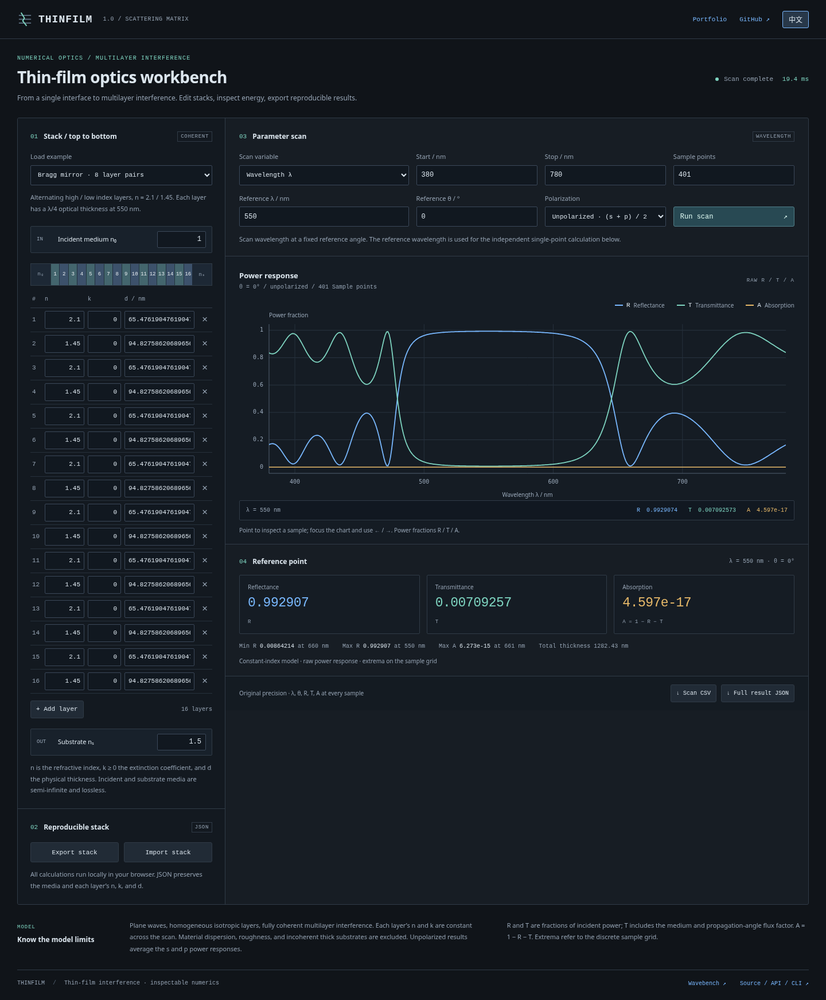
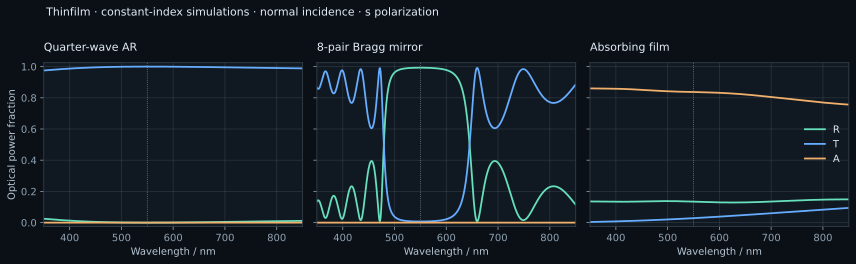

# Thinfilm

多层薄膜光学散射库、浏览器仪器与零运行依赖 Node.js CLI。输出复反射/透射系数以及真实的反射、透射、吸收功率比例。

[在线工作台](https://bdbddscat.github.io/portfolio-studio-demos/thinfilm/)

[](https://bdbddscat.github.io/portfolio-studio-demos/thinfilm/)

[English](README.md) · [物理模型](docs/physics.md) · [示例膜系](examples/README.md)

使用稳定散射递推，仅传播衰减因子，避免厚吸收膜的特征矩阵指数溢出。支持 `s`、`p`、非偏振光，波长扫描、角度扫描、逐层编辑、膜系 JSON 导入导出、原始 CSV 与结果 JSON。



## 运行

Node.js 22 及以上；不需要安装依赖。

```sh
npm test
npm run serve
```

打开 `http://127.0.0.1:8080`。页面加载后在本地完成计算；请通过 HTTP 打开，而不是直接双击 HTML。

## CLI

```sh
node bin/thinfilm.js spectrum --stack examples/ar.json \
  --start 400 --stop 800 --points 201 --angle 0 --polarization s --out out
node bin/thinfilm.js angle --stack examples/interface.json \
  --wavelength 550 --start 0 --stop 85 --points 171 --polarization p --out out-angle
```

`--out DIR` 输出 `curve.csv`、`stack.json`、`result.json`；覆盖已有文件必须传入 `--force`，输出与输入膜系文件重叠则始终拒绝。省略 `--out` 时向标准输出写 CSV。`--help` 查看完整选项；未知、重复或非法参数会明确报错。

## 库接口

```js
import { solveStack, wavelengthScan, angleScan } from "./src/thinfilm.js";

const n = Math.sqrt(1.5);
const stack = {
  incident: 1,
  substrate: 1.5,
  layers: [{ n, k: 0, dNm: 550 / (4 * n) }],
};
const result = solveStack(stack, {
  wavelengthNm: 550,
  angleDeg: 0,
  polarization: "s",
});
// result: {r:{re,im}, t:{re,im}, R, T, A, ...}
// 理想匹配四分之一波减反膜在设计波长处 R≈0、T≈1。
const scan = wavelengthScan(stack, { startNm: 400, stopNm: 800, points: 201 });
```

扫描返回 `{kind, polarization, rows, diagnostics}`。非偏振结果平均 `s` 与 `p` 的功率，复系数为 `null`，分量在 `components` 中；不会把非相干光伪装成一个平均复振幅。

## 模型边界

- 约定为 `exp(-iωt)`，层折射率为 `n + ik`，`n > 0`、`k ≥ 0`；波长、厚度单位均为 nm。
- 入射与基底介质折射率是正实数。最多 128 层、2001 个扫描点，入射角 0–85°。
- 均匀、平面、各向同性、相干薄膜；折射率不随波长变化，基底半无限。
- 不包含色散、粗糙度、散射、各向异性、荧光及厚基底的部分相干效应；示例为模拟值，并非实测材料数据。
- 基底临界角按零法向透射通量极限处理。有限内部层的 `q≈0` 行波分解退化，会明确拒绝；请略微调整角度。[详见物理说明](docs/physics.md)。

`npm test` 独立验证 Fresnel 单界面、Brewster 角、全反射、无损功率守恒、减反膜、Bragg 峰、厚吸收稳定性及 CLI/API 一致性。MIT 许可。

结果 JSON 导入会恢复完整扫描配置，并拒绝非法模式、偏振或冲突参数。文件上限为 10 MB，可以恢复 2001 点非偏振扫描。
