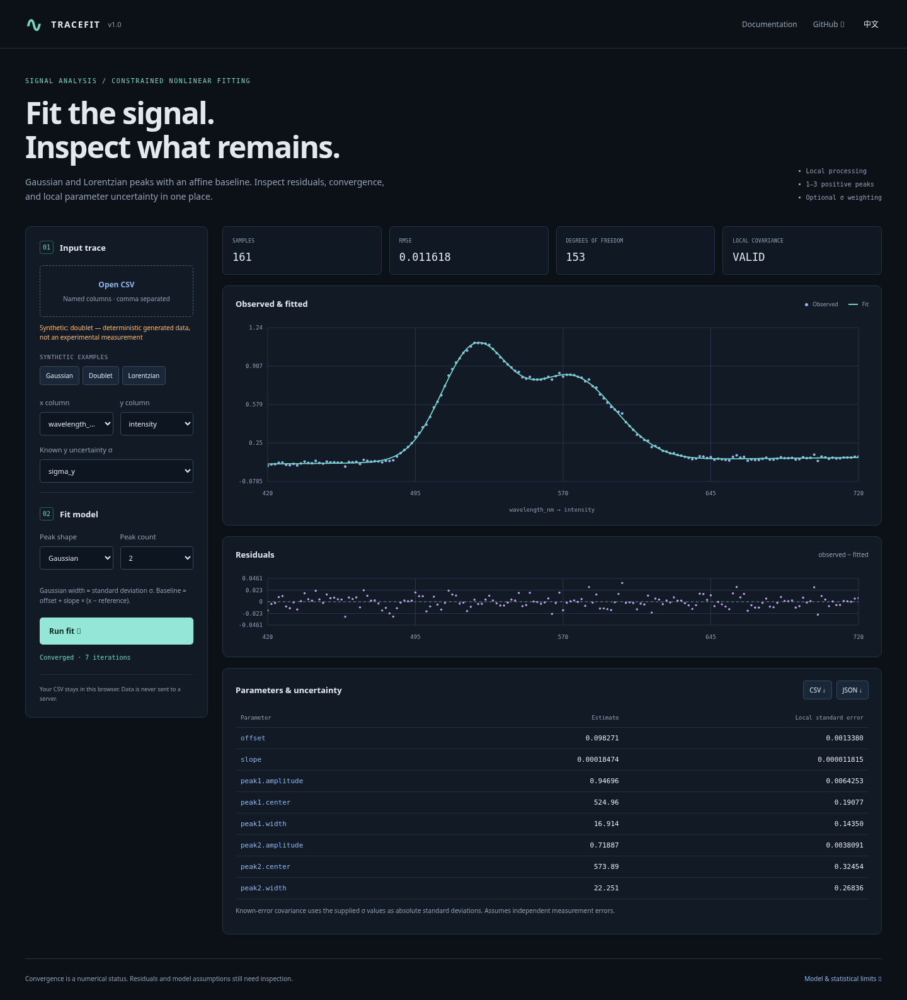

# Tracefit

**带残差分析与局部不确定度诊断的约束峰拟合工具。**

[在线工作台](https://bdbddscat.github.io/portfolio-studio-demos/tracefit/) · [English](README.md) · [模型与统计说明](docs/model.md)

[](https://bdbddscat.github.io/portfolio-studio-demos/tracefit/)

使用同一个无运行依赖的数值引擎，在浏览器、Node 命令行或 ES 模块中拟合曲线。支持 1–3 个正高斯峰或洛伦兹峰，以及仿射基线。浏览器提供 CSV 上传、数据列选择、观测与拟合图、残差图、参数标准误表和 CSV/JSON 导出；所有计算均在本地完成。

内置三个示例均为带确定性生成噪声的**合成数据**，不代表真实实验测量。

## 命令行

需要 Node 22 或更新版本，无需安装依赖。

```sh
node bin/tracefit.js fit \
  --input examples/gaussian.csv \
  --x wavelength_nm --y intensity \
  --model gaussian --peaks 1 --out out

node bin/tracefit.js fit \
  --input examples/doublet.csv \
  --x wavelength_nm --y intensity --sigma sigma_y \
  --model gaussian --peaks 2 --out doublet-out

node bin/tracefit.js --help
```

输出 `fit.json` 和 `fitted.csv`。JSON 保存全部输入样本、数据列名、模型参数、算法设置、收敛状态、协方差有效性与诊断信息。CSV 包含 `x,y,sigma,fitted,residual,source_line`；残差定义为观测值减拟合值，未选择 σ 列时该列为空。列名会被保留，物理单位不会根据列名猜测。

已有输出需要显式指定 `--force`。即使使用此标志，也禁止覆盖输入文件及其符号链接、硬链接别名；应改用其他输出目录。错误输入退出码为 `2`，未收敛为 `3`，收敛或帮助为 `0`。未收敛时仍保留诊断结果，协方差标为无效，标准误为 `null`。

`--model` 接受 `gaussian` 或 `lorentzian`；`--peaks` 为 `1..3`；`--iterations` 为每个起点的迭代上限，默认 `150`，范围 `1..1000`；`--starts` 为确定性起点数量，默认 `5`，范围 `1..20`。不指定 x/y 列时，使用前两列。

## 库接口

```js
import { fitTrace, evaluateTrace } from './src/fit.js';

const result = fitTrace(samples, { model: 'gaussian', peaks: 2 });
// samples: [{x, y, sigma?, sourceLine?}, ...]
if (result.converged) {
  const y = evaluateTrace(550, result.parameters, result.model);
}
```

输入值必须有限，σ 必须为正且覆盖所有样本。重复 x 会被拒绝；需要先明确合并重复测量。数据按 x 排序并保留来源行号。最少样本数为 `max(8, 3 × 峰数 + 4)`。

高斯的宽度是**标准差 σ**，洛伦兹的宽度是**半高半宽**。拟合器使用有边界的 Levenberg–Marquardt、解析雅可比、坐标归一化与确定性多起点。收敛仅说明数值停止条件成立，不保证模型正确或找到全局最优解。

未提供 σ 时，局部协方差由残差方差缩放；提供 σ 时，按已知绝对测量标准差计算。矩阵奇异、参数接近边界或未收敛时，不输出伪精确标准误。具体公式、约束与假设见 [统计说明](docs/model.md)。

```sh
npm test
npm run serve
# 浏览器打开 http://127.0.0.1:8080
```

MIT · [BDBDDSCAT](https://github.com/BDBDDSCAT)
