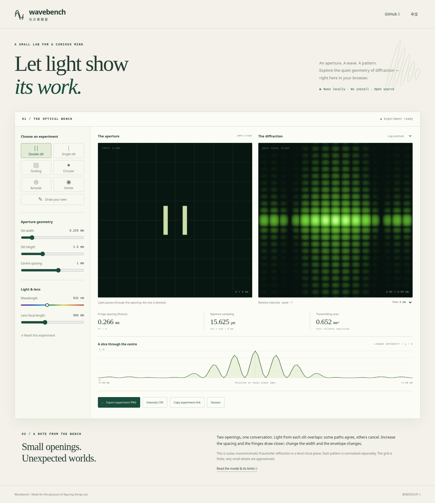

# Wavebench · 光の実験室

**[在线体验](https://bdbddscat.github.io/portfolio-studio-demos/wavebench/)** · [English](README.md) · [日本語](README.ja.md)

画一个孔，看看光会落在哪里。

一个浏览器里的衍射实验台。调整双缝、光栅、圆孔或相位掩模，直接观察
焦平面上的图样；也可以自己画孔径，再导出图像和数据。

[](https://bdbddscat.github.io/portfolio-studio-demos/wavebench/)

## 可以做什么

- 六种参数化实验：单缝、双缝、光栅、圆孔、环形孔、涡旋相位。
- 自定义孔径绘制与擦除，查看振幅或相位。
- 调整波长、焦距和孔径参数；切换线性或对数显示。
- 查看带物理距离坐标的中心强度截面，导出 PNG 和 CSV。
- 参数化实验可以复制链接；自定义图形通过 JSON 会话导出和导入。

HTML / CSS / JavaScript 构成，无运行时依赖、CDN、统计脚本或 API 密钥。
计算与文件导出均在浏览器内完成。自定义孔径的像素数据不包含在分享链接里。

## 动起来

```bash
git clone https://github.com/BDBDDSCAT/portfolio-studio-demos.git
cd portfolio-studio-demos/wavebench
python3 -m http.server 8080 --bind 127.0.0.1
```

打开 <http://127.0.0.1:8080>，无需安装 npm 包。页面使用 JavaScript 模块，
请通过 HTTP 服务打开。复制链接需要 HTTPS 或 localhost，以及浏览器允许。

先试双缝：增大缝间距，条纹会变密。再试圆孔：缩小孔径，中央亮斑会变宽。

## 模型边界

采用理想透镜焦平面上的标量、单色夫琅禾费衍射模型，以二维 FFT 计算。
默认在 8 mm 窗口内使用 512 × 512 网格。每幅结果分别按峰值归一化，
适合观察形状和相对强度，不能据此比较不同孔径的绝对亮度。
网格采样会限制细小结构的精度；近场传播、偏振和镜头像差不在模型内。

公式与采样说明见 [docs/physics.md](docs/physics.md)。测试和贡献说明见
[CONTRIBUTING.md](CONTRIBUTING.md)。采用 [MIT License](LICENSE)。
